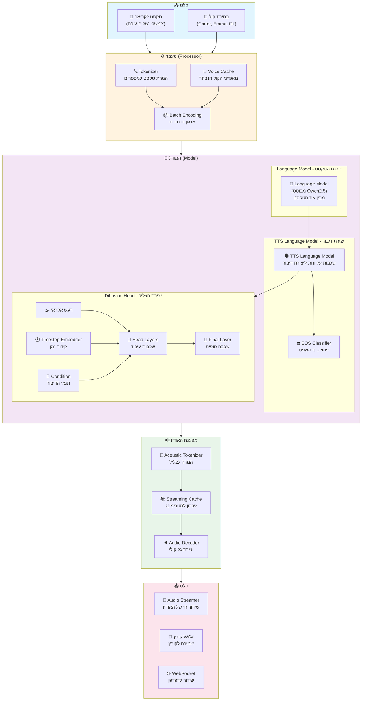
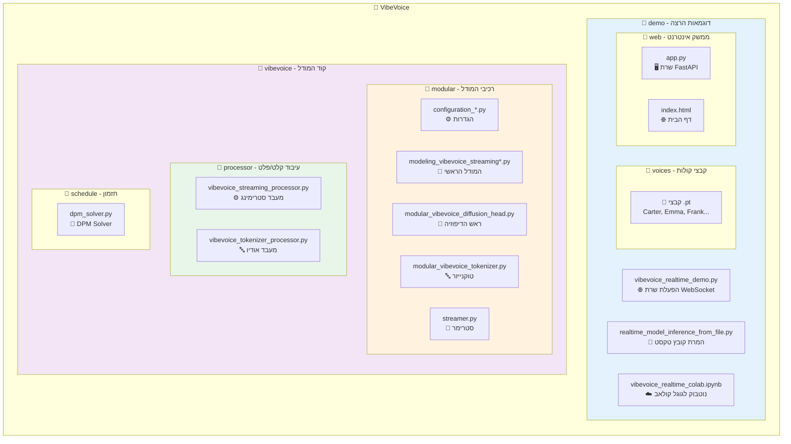
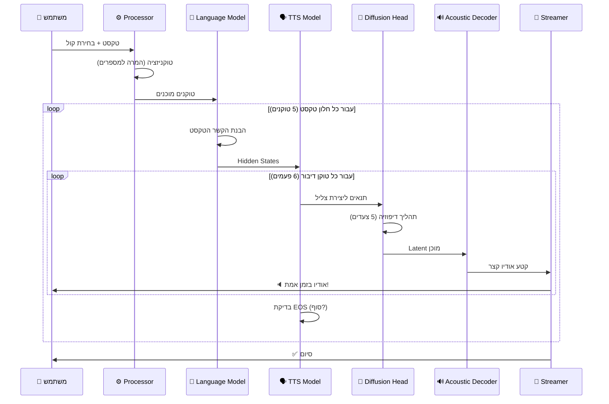
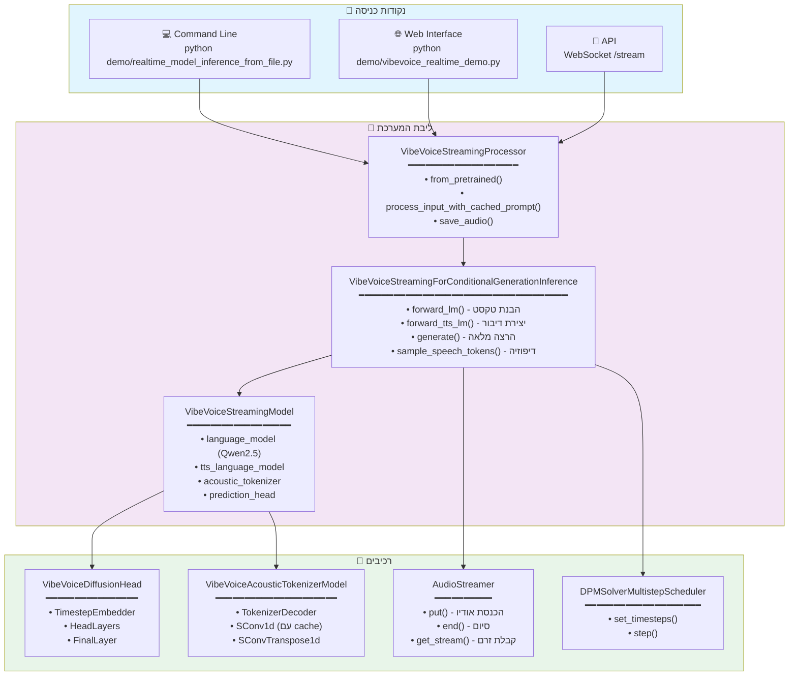
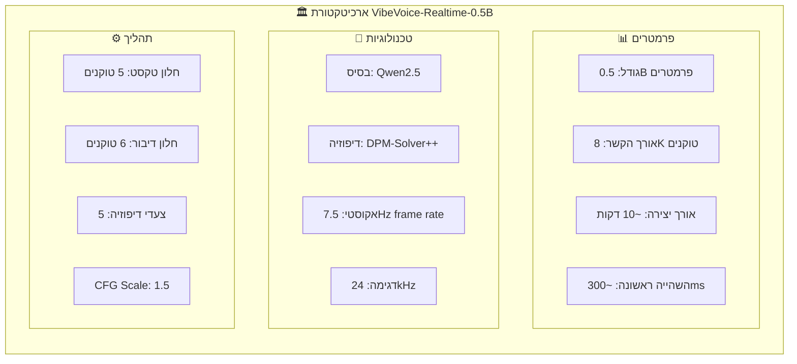

<div align="center">

# 🎙️ VibeVoice - מערכת המרת טקסט לדיבור בזמן אמת

[](https://huggingface.co/collections/microsoft/vibevoice-68a2ef24a875c44be47b034f)
[](https://colab.research.google.com/github/microsoft/VibeVoice/blob/main/demo/vibevoice_realtime_colab.ipynb)

<picture>
  <source media="(prefers-color-scheme: dark)" srcset="Figures/VibeVoice_logo_white.png">
  
</picture>

**מערכת AI מתקדמת של מיקרוסופט להפיכת טקסט לדיבור אנושי טבעי**

</div>

---

## 📖 מה זה VibeVoice? (בפשטות)

דמיינו שיש לכם "קורא" אוטומטי שיודע לקרוא כל טקסט בקול אנושי טבעי - זה בדיוק מה ש-VibeVoice עושה!

### ⚡ יכולות עיקריות

| יכולת | הסבר |
|--------|------|
| **זמן אמת** | מתחיל לדבר תוך ~300 מילישניות |
| **סטרימינג** | לא צריך לחכות שכל הטקסט יעובד |
| **קולות מגוונים** | גברים, נשים, שפות שונות |
| **איכות גבוהה** | קול טבעי שנשמע כמו אדם אמיתי |

---

## 🎯 דוגמאות שימוש מעשיות

### 1. 🤖 צ'אט בוט מדבר
```
משתמש: "מה מזג האוויר היום?"
→ הבוט לא רק מציג טקסט, אלא גם מדבר את התשובה בקול!
```

### 2. 📚 הקראת ספרים
```
קובץ טקסט של ספר → קובץ אודיו מוכן להאזנה
(יצירת אודיובוקים אוטומטית)
```

### 3. ♿ נגישות
```
אתר אינטרנט → הקראה קולית לאנשים עם לקויות ראייה
```

### 4. 🎙️ פודקאסטים
```
תסריט כתוב → פודקאסט מוכן עם קולות שונים
```

### 5. 📞 מוקדי שירות
```
מענה קולי אוטומטי → תגובות טבעיות ללקוחות
```

---

## 🏗️ איך המערכת עובדת? (תרשים מפורט)



---

## 📁 מבנה הפרויקט



---

## 🔄 זרימת הנתונים המלאה



---

## 🔗 קשרים בין הרכיבים



---

## 🚀 התקנה והרצה

### דרישות מקדימות
- Python 3.9+
- CUDA (מומלץ) או MPS (Mac) או CPU
- ~4GB זיכרון GPU

### התקנה

```bash
# שכפול הפרויקט
git clone https://github.com/microsoft/VibeVoice.git
cd VibeVoice

# התקנת החבילה
pip install -e .
```

### הרצת דמו בזמן אמת (WebSocket)

```bash
python demo/vibevoice_realtime_demo.py --model_path microsoft/VibeVoice-Realtime-0.5B
```

פתחו את הדפדפן בכתובת `http://localhost:3000`

### המרת קובץ טקסט

```bash
python demo/realtime_model_inference_from_file.py \
    --model_path microsoft/VibeVoice-Realtime-0.5B \
    --txt_path demo/text_examples/1p_vibevoice.txt \
    --speaker_name Carter
```

---

## 🎤 קולות זמינים

| שפה | קולות גברים | קולות נשים |
|-----|-------------|-------------|
| 🇺🇸 אנגלית | Carter, Davis, Frank, Mike | Emma, Grace |
| 🇩🇪 גרמנית | de-Spk0 | de-Spk1 |
| 🇫🇷 צרפתית | fr-Spk0 | fr-Spk1 |
| 🇮🇹 איטלקית | it-Spk1 | it-Spk0 |
| 🇯🇵 יפנית | jp-Spk0 | jp-Spk1 |
| 🇰🇷 קוריאנית | kr-Spk1 | kr-Spk0 |
| 🇳🇱 הולנדית | nl-Spk0 | nl-Spk1 |
| 🇵🇱 פולנית | pl-Spk0 | pl-Spk1 |
| 🇵🇹 פורטוגזית | pt-Spk1 | pt-Spk0 |
| 🇪🇸 ספרדית | sp-Spk1 | sp-Spk0 |
| 🇮🇳 הינדית | Samuel | - |

---

## 📊 ארכיטקטורת המודל



---

## ⚠️ מגבלות והתראות

### מגבלות טכניות
- 🔤 **שפות**: אנגלית עובדת הכי טוב, שפות אחרות ניסיוניות
- 📏 **טקסט קצר**: פחות מ-3 מילים עלול להיות לא יציב
- 🔢 **קוד ונוסחאות**: לא תומך בקריאת קוד או מתמטיקה
- 🎵 **רעשי רקע**: לא יוצר מוזיקה או אפקטים קוליים

### אזהרות חשובות
⚠️ **סיכוני Deepfake**: המערכת יכולה ליצור קולות משכנעים. השתמשו באחריות!

⚠️ **שימוש מחקרי בלבד**: לא מומלץ לשימוש מסחרי ללא בדיקות נוספות.

⚠️ **גילוי נאות**: תמיד ציינו כשמשתמשים בתוכן שנוצר ע"י AI.

---

## 📄 רישיון

ראו קובץ [LICENSE](LICENSE) לפרטים.

---

## 🔗 קישורים

- [דף הפרויקט](https://microsoft.github.io/VibeVoice)
- [HuggingFace](https://huggingface.co/microsoft/VibeVoice-Realtime-0.5B)
- [דוח טכני](https://arxiv.org/pdf/2508.19205)
- [נסו ב-Colab](https://colab.research.google.com/github/microsoft/VibeVoice/blob/main/demo/vibevoice_realtime_colab.ipynb)

---

<div align="center">

**נוצר על ידי צוות VibeVoice במיקרוסופט** 🎙️

</div>
